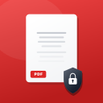

<p align="center">
  
</p>

<h1 align="center">veilpdf-core</h1>

<p align="center">
  <strong>Privacy-first PDF engine. Your documents never leave your machine.</strong>
</p>

<p align="center">
  Merge, split, compress, sanitize, and extract images from PDFs.<br>
  Zero network dependencies. Auditable Rust. MIT licensed.
</p>

<p align="center">
  <a href="core/LICENSE-MIT"></a>
  
  
  
</p>

---

## Why?

Most PDF libraries pull in HTTP clients, async runtimes, or cloud SDKs. If you're processing sensitive documents — tax returns, contracts, medical records — that's a liability.

`veilpdf-core` has **zero networking dependencies**. No `reqwest`, no `hyper`, no sockets. Your bytes go in, your bytes come out. The entire codebase is under 2,000 lines of Rust you can read in an afternoon.

This is the engine behind [VeilPDF](https://veilpdf.com), a native macOS app with 47 PDF tools — available as a one-time $29 purchase on the Mac App Store.

## Features

| Operation | What it does | How |
|-----------|-------------|-----|
| **Merge** | Combine multiple PDFs into one | Object ID remapping + page tree manipulation |
| **Split** | Extract individual pages | Per-page document cloning with `prune_objects` |
| **Compress** | Reduce file size | Stream compression + JPEG recompression + downscaling |
| **Sanitize** | Strip dangerous content | Remove JS, actions, embedded files, metadata, XMP |
| **Extract** | Pull images from PDFs | JPEG passthrough, FlateDecode→PNG conversion |

## Security

- **Encrypted PDF detection** — rejects password-protected files cleanly instead of producing garbage
- **Bounded decompression** — zip bombs capped at 256 MB, not your entire RAM
- **Image decode limits** — 100 megapixel cap prevents OOM on malicious image streams
- **FFI panic safety** — all C-facing functions wrapped in `catch_unwind`
- **Input size limits** — 512 MB max per document at the FFI boundary
- **No network** — zero networking dependencies, impossible to phone home

## Quick start

```toml
[dependencies]
veilpdf-core = { git = "https://github.com/iMADDDDDD/veilpdf-core" }
```

```rust
use veilpdf_core::{merge_pdfs, split_pdf, compress_pdf};

// Merge
let merged = merge_pdfs(&["a.pdf", "b.pdf"]).unwrap();
std::fs::write("merged.pdf", merged).unwrap();

// Split into individual pages
let pages = split_pdf("document.pdf").unwrap();
for (i, page) in pages.iter().enumerate() {
    std::fs::write(format!("page_{}.pdf", i + 1), page).unwrap();
}

// Compress
let result = compress_pdf("large.pdf").unwrap();
std::fs::write("small.pdf", result.data).unwrap();
println!("Reduced by {:.1}%", result.reduction_percent);
```

## Advanced compression

```rust
use veilpdf_core::{compress_pdf_with_options, CompressOptions};

let data = std::fs::read("input.pdf").unwrap();
let result = compress_pdf_with_options(&data, &CompressOptions {
    image_quality: 60,          // JPEG quality (1-100)
    max_image_dimension: 1600,  // Downscale images larger than this
    strip_metadata: true,       // Remove author, creation date, XMP, thumbnails
}).unwrap();

println!("{:.1} MB → {:.1} MB ({:.1}% reduction)",
    result.input_size as f64 / 1_048_576.0,
    result.output_size as f64 / 1_048_576.0,
    result.reduction_percent);
```

## Sanitize

Remove JavaScript, actions, embedded files, and metadata from untrusted PDFs:

```rust
use veilpdf_core::sanitize::{sanitize_pdf, FLAG_REMOVE_JS, FLAG_REMOVE_ACTIONS, FLAG_STRIP_METADATA};

let data = std::fs::read("untrusted.pdf").unwrap();
let clean = sanitize_pdf(&data, FLAG_REMOVE_JS | FLAG_REMOVE_ACTIONS | FLAG_STRIP_METADATA).unwrap();
std::fs::write("clean.pdf", clean).unwrap();
```

Flags: `FLAG_STRIP_METADATA` · `FLAG_REMOVE_JS` · `FLAG_REMOVE_EMBEDDED` · `FLAG_REMOVE_ACTIONS` · `FLAG_REMOVE_XMP`

## Extract images

```rust
use veilpdf_core::extract_images;

let data = std::fs::read("document.pdf").unwrap();
let images = extract_images(&data).unwrap();
for (i, img) in images.iter().enumerate() {
    let ext = if img.format == 0 { "jpg" } else { "png" };
    std::fs::write(format!("image_{}.{}", i + 1, ext), &img.data).unwrap();
    println!("{}x{} {}", img.width, img.height, ext.to_uppercase());
}
```

## C FFI

The library compiles as a static `.a` for embedding in Swift, Objective-C, C, or any language with C FFI:

```c
VeilBuffer veil_merge(const uint8_t *a, size_t a_len, const uint8_t *b, size_t b_len);
VeilBuffer veil_split(const uint8_t *ptr, size_t len);
VeilBuffer veil_compress(const uint8_t *ptr, size_t len);
VeilBuffer veil_compress_ex(const uint8_t *ptr, size_t len, uint8_t quality, uint32_t max_dim, uint8_t strip_meta);
VeilBuffer veil_sanitize(const uint8_t *ptr, size_t len, uint32_t flags);
VeilBuffer veil_extract_images(const uint8_t *ptr, size_t len);
void veil_free_buffer(VeilBuffer buf);
```

```bash
cargo build --release
# Output: target/release/libveilpdf_core.a
```

## Architecture

```
┌──────────────────────────────────────────────────────┐
│           veilpdf-core (Rust, MIT)                    │
│                                                       │
│  Merge    Split    Compress    Sanitize    Extract    │
│  (lopdf)  (lopdf)  (lopdf +    (lopdf)    (image +   │
│                     image +                 lopdf)    │
│                     flate2)                           │
│                                                       │
│  Zero network · Bounded decompress · Panic-safe FFI   │
└──────────────────────────────────────────────────────┘
```

### Dependencies

| Crate | Purpose | Why |
|-------|---------|-----|
| [lopdf](https://crates.io/crates/lopdf) 0.34 | PDF object manipulation | Pure Rust, no C dependencies, handles page trees and object remapping |
| [image](https://crates.io/crates/image) 0.25 | Image decode/encode | JPEG + PNG only (minimal feature flags) for recompression |
| [flate2](https://crates.io/crates/flate2) 1.x | Deflate compression | Bounded decompression to prevent zip bombs (lopdf's built-in silently fails) |

That's it. No async runtime, no TLS, no serialization framework.

## Building

```bash
cargo build --release    # Build static library
cargo test               # Run tests
cargo clippy             # Lint
cargo doc --open         # Generate docs
```

## The macOS app

This library powers [VeilPDF](https://veilpdf.com) — a native macOS app with 47 PDF tools, available as a one-time $29 purchase on the Mac App Store.

This repo contains the Rust engine that handles byte-level PDF operations — the part where your raw document data is processed. This is the code you'd want to audit if you care about privacy. The macOS app adds 42 additional tools built on Apple's PDFKit, Core Image, and WebKit frameworks:

- **PDFKit** — page organization, rotation, annotations, form filling, signatures, stamps, watermarks, page numbers, passwords, permissions, bookmarks, metadata, flattening, comparing, repair
- **Core Image** — contrast adjustment, scanner effect, color replacement
- **WebKit** — HTML to PDF conversion
- **NSAttributedString** — Markdown to PDF conversion

The app source is proprietary — the open-source core is the trust layer that proves your files stay local.

## Contributing

Contributions are welcome. The codebase is intentionally small — please keep it that way.

```bash
cargo test && cargo clippy    # Must pass before submitting
```

## License

MIT — see [LICENSE-MIT](core/LICENSE-MIT).

---

<p align="center">
  <strong>Made by <a href="https://github.com/iMADDDDDD">Imad Eddine Yamani</a></strong>
</p>
